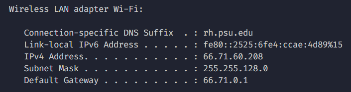

# Landing Place Mobile App (iOS)

## Setup Code

1. Clone [LandingPlace](https://github.com/crshelton01/LandingPlace) respository
2. Install npm packages:
   open terminal, cd to the LandingPlace directory, and run following command

```bash
npm install
```

## Development Run

1. Make sure you have the [LandingPlaceBackend](https://github.com/crshelton01/LandingPlaceBackend) setup (refer to README in the repository for instructions) and run the development server
2. Open a terminal (to any location) and run the following command:

```bash
ipconfig
```

3. Find the IP address your computer is connected to.
   
   IP address is `66.71.60.208` in this case
4. Replace the IP address in the [.env.development](.env.development) file with your IP address: `http://x.x.x.x:3000/api`
5. Make sure you have the Expo Go app (install it from the App Store)
6. Open terminal and cd to the Landing Place directory
7. Run the following command:

```bash
npx expo start
```

4. Once you receive a QR code, hit `s` in the terminal to get Expo Go QR code
5. Scan the QR code on your iOS device
6. Tap on `Expo Go` on the website that opens up

## To fix `ViewPropTypes` error...

open files:

1. ./node_modules/react-native-snap-carousel/src/carousel/Carousel.js
2. ./node_modules/react-native-snap-carousel/src/Pagination/Pagination.js
3. ./node_modules/react-native-snap-carousel/src/Pagination/PaginationDot.js
4. ./node_modules/react-native-snap-carousel/src/ParallaxImage/ParallaxImage.js

edit

```js
import { ... , ViewPropTypes } from 'react-native';
```

to

```js
import { ... } from 'react-native';
import { ViewPropTypes } from 'deprecated-react-native-prop-types';
```
